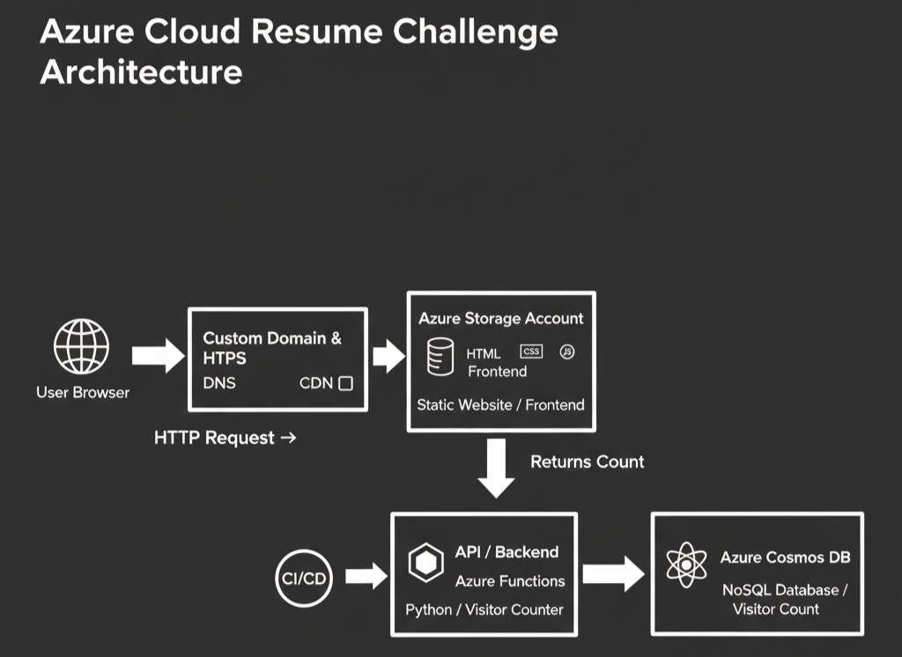

# Azure Cloud Resume Challenge

This repository contains the code for my Cloud Resume Challenge, a full-stack serverless application deployed on Microsoft Azure. It features a visitor counter powered by Azure Functions and Cosmos DB.

## Project Structure

### Frontend: The user interface
* **index.html**: The resume content and structure.
* **style.css**: Custom styling and layout.
* **script.js**: JavaScript to fetch and update the visitor counter via the Backend API.

### Backend: The serverless API
* **function_app.py**: Azure Function (Python v2 model) logic.
* **requirements.txt**: Python dependencies.
* **host.json & .funcignore**: Azure Function configuration files.

---

## Architecture Overview

* **Storage**: The Frontend is hosted as a Static Website in an Azure Storage Account.
* **DNS and CDN**: Azure DNS and Azure CDN provide a custom domain and HTTPS.
* **Database**: Azure Cosmos DB stores the visitor count.
* **API**: An Azure Function (Python) increments the counter every time the page is loaded.
* **CI/CD**: Automated deployments via GitHub Actions.

---

